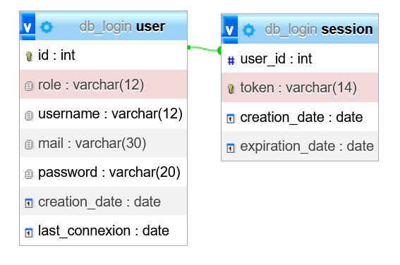

# LOGGER PHP

description de l' API

## Use case

## MCD

## Routing de l'API

Base URL de l'API : http://localhost:3030

|  METHODE  |  PATH  |  DESCRIPTION  |
|  -------  |  ----  |  -----------  |
|GET|/users/getAllUsers|liste de tous les utilisateurs|
|POST|/register|création d'un utilisateur dans la BDD|
|POST|/login|etabli la connexion|
|GET|/logout|Permet la déconnexion|
|-------|----|-----------|
